# Mini Trello App

A modern task management application built with React, TypeScript, and Node.js.

## Features

- Authentication with Email OTP and GitHub OAuth
- Board Management
- Card & Task Management
- Member Management
- Task Assignment
- Real-time Updates
- Responsive Design

## Tech Stack

### Frontend

- React
- TypeScript
- Material-UI
- React DnD
- Socket.io Client
- Axios

### Backend

- Node.js
- Express
- Firebase
- Socket.io
- TypeScript

## Getting Started

### Installation

1. Clone the repository:

```bash
git clone https:...............
cd mini-trello
```

2. Install dependencies:

```bash
cd web
npm install

cd ../server
npm install
```

3. Configure environment variables:

```bash
# Frontend (.env)
VITE_API_URL=.....
VITE_FIREBASE_CONFIG=...

# Backend (.env)
PORT=...
FIREBASE_CONFIG=...
```

4. Start the development servers:

```bash
# Start backend
cd server
npm run dev

# Start frontend
cd web
npm run dev
```

## Screenshots (Ảnh chụp màn hình các Page)

### Authentication

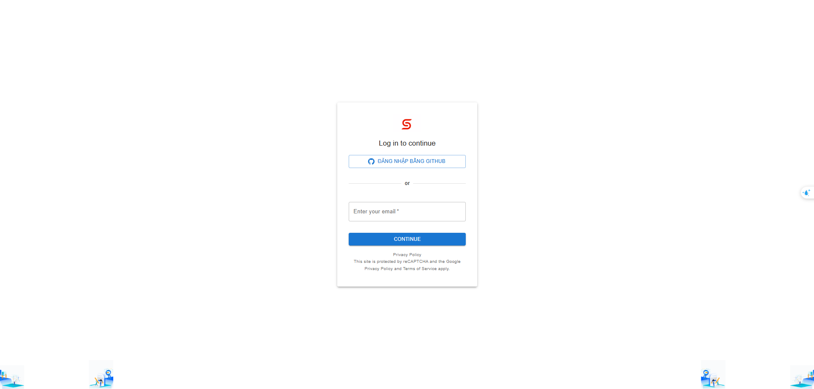
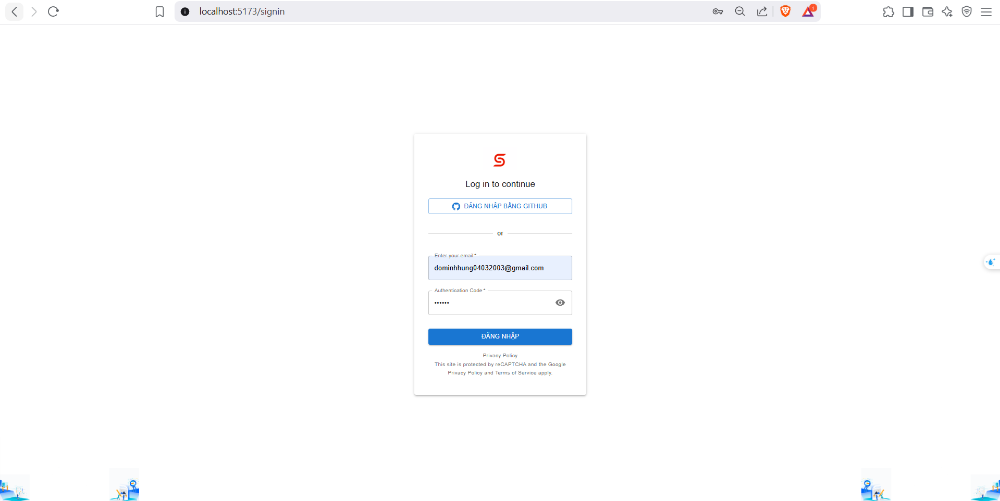

### Board Management

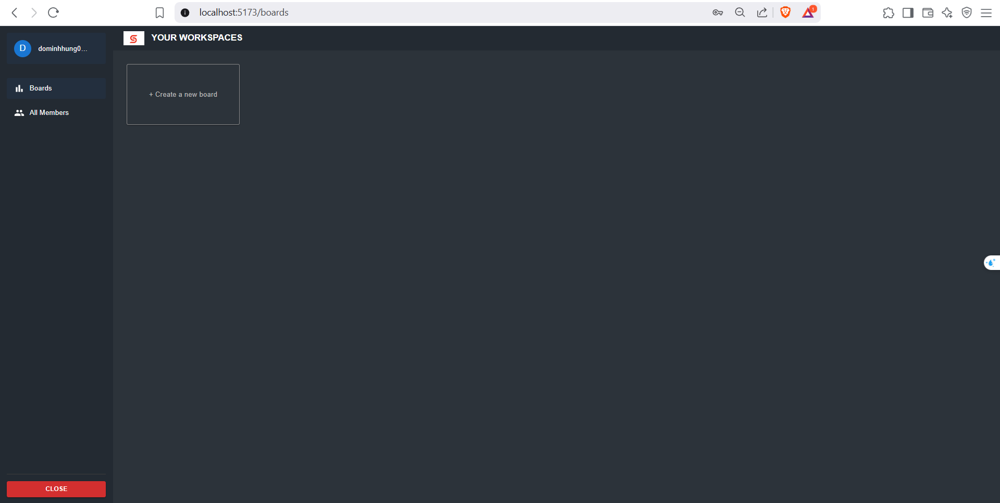
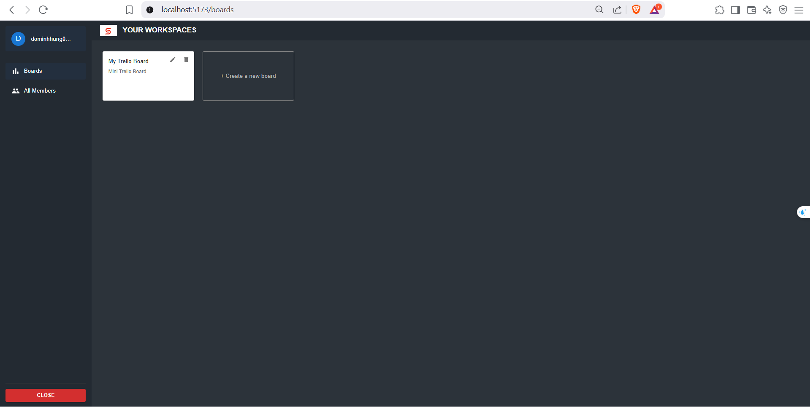


### Card & Task

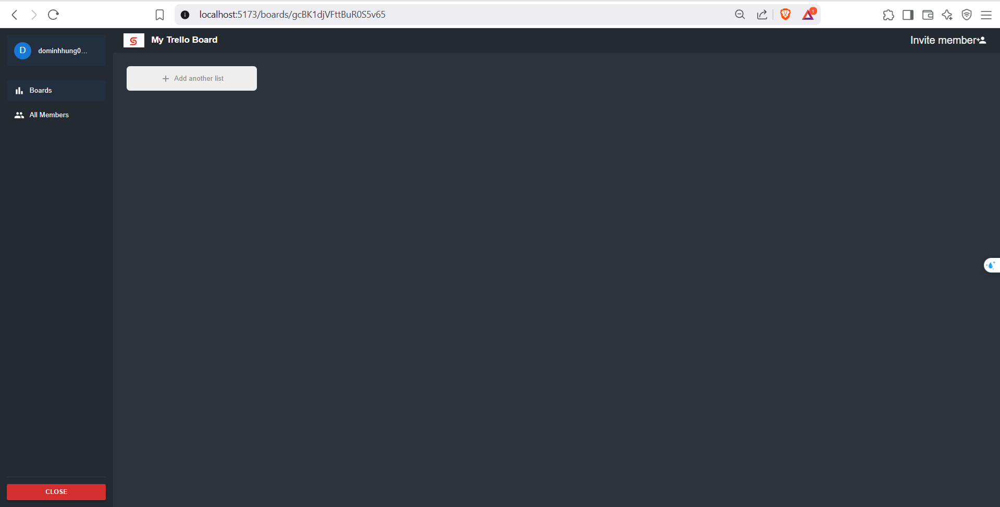

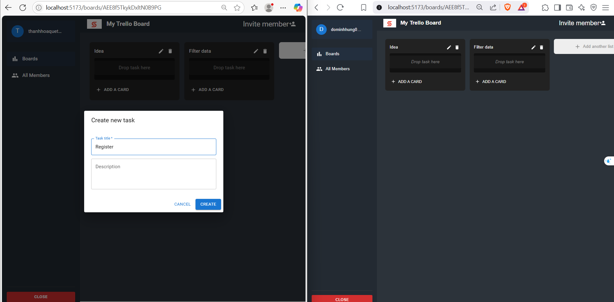
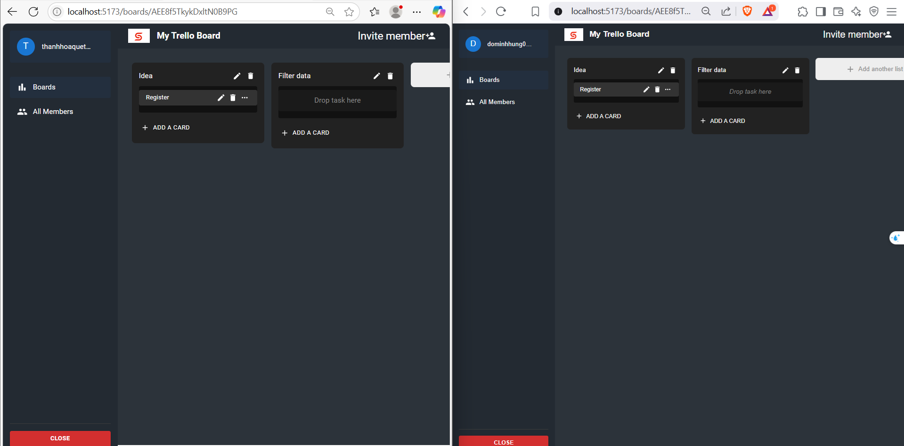


### Member Management

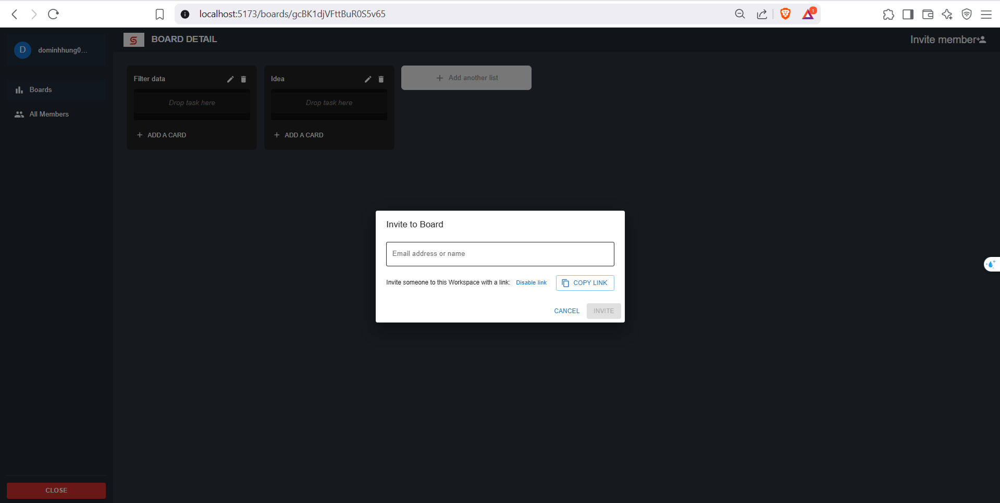
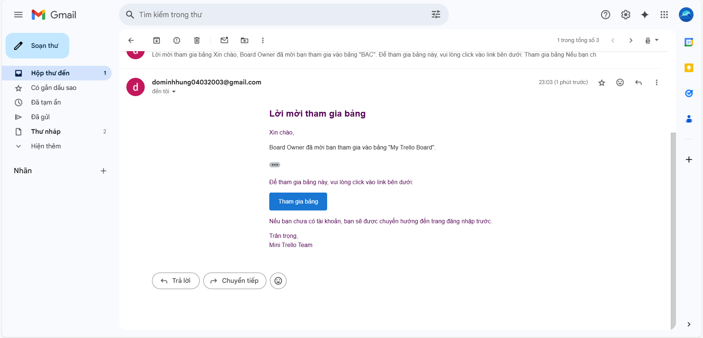
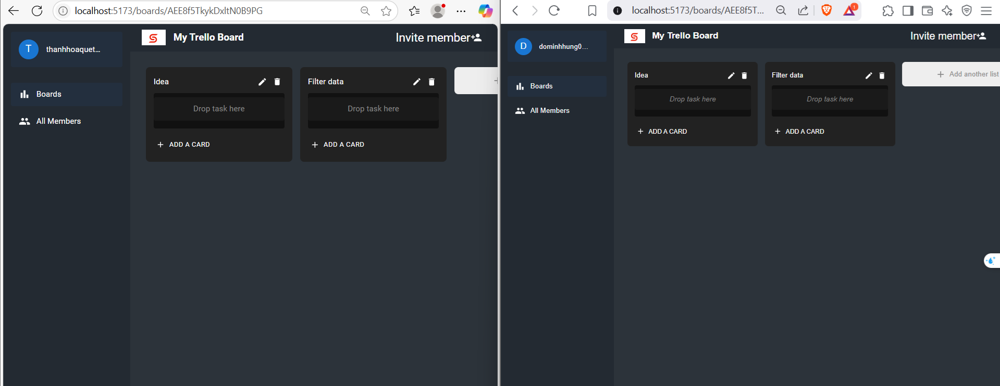

### Task Assignment

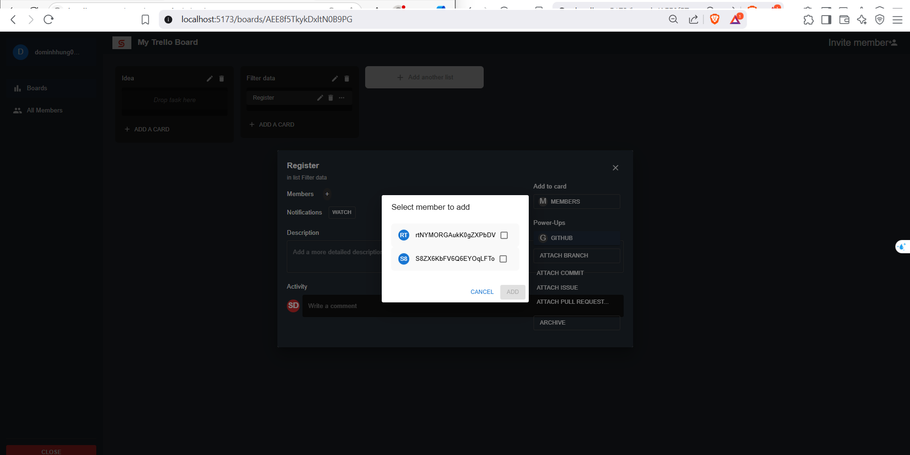
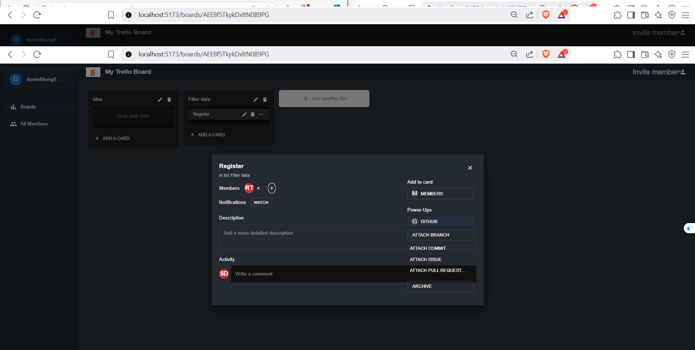

## API Documentation

### Authentication

- `POST /auth/email` - Send OTP to email
- `POST /auth/verify` - Verify OTP
- `GET /auth/github` - GitHub OAuth
- `GET /auth/github/callback` - GitHub OAuth callback

### Boards

- `GET /boards` - Get all boards
- `POST /boards` - Create board
- `GET /boards/:id` - Get board details
- `PUT /boards/:id` - Update board
- `DELETE /boards/:id` - Delete board

### Cards

- `GET /boards/:boardId/cards` - Get all cards
- `POST /boards/:boardId/cards` - Create card
- `PUT /boards/:boardId/cards/:id` - Update card
- `DELETE /boards/:boardId/cards/:id` - Delete card

### Tasks

- `GET /boards/:boardId/cards/:cardId/tasks` - Get all tasks
- `POST /boards/:boardId/cards/:cardId/tasks` - Create task
- `PUT /boards/:boardId/cards/:cardId/tasks/:id` - Update task
- `DELETE /boards/:boardId/cards/:cardId/tasks/:id` - Delete task

### Members

- `GET /boards/:boardId/members` - Get board members
- `POST /boards/:boardId/members` - Invite member
- `DELETE /boards/:boardId/members/:id` - Remove member

### Task Assignment

- `POST /boards/:boardId/cards/:cardId/tasks/:taskId/assign` - Assign member
- `DELETE /boards/:boardId/cards/:cardId/tasks/:taskId/assign/:memberId` - Remove member
