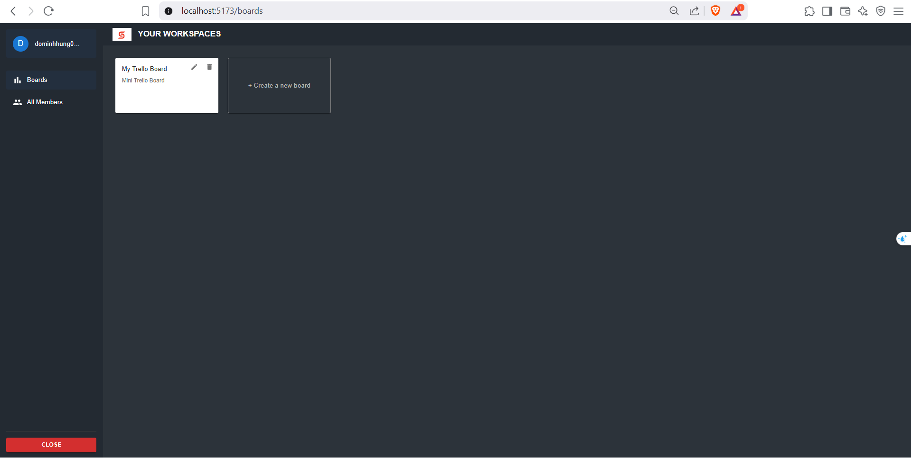
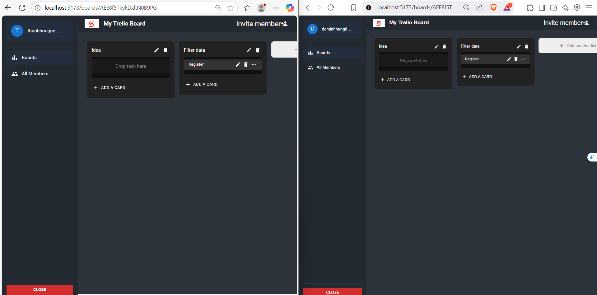

# Mini Trello App

## Giới thiệu

Mini Trello App là một ứng dụng quản lý công việc theo phong cách Trello Clone, hỗ trợ realtime (socket.io, socket.io-client), kéo thả, gán thành viên vào task, tích hợp GitHub, xác thực bằng email code.

## Cấu trúc dự án

```
Project/
├── server/                 # Backend NodeJS/Express + Firebase
│   ├── controllers/        # Các controller xử lý logic API
│   ├── routes/             # Định nghĩa các route API
│   ├── configs/            # Cấu hình Firebase, email, GitHub, CORS
│   ├── middlewares/        # Middleware xác thực, CORS
│   ├── index.js            # File khởi động server
│
├── web/                    # Frontend React + TypeScript
│   ├── src/
│   │   ├── components/     # Các component giao diện
│   │   ├── pages/          # Các trang chính
│   │   ├── services/       # Gọi API backend
│   │   ├── types/          # Định nghĩa type
│   │   └── ...
│   ├── public/
│
├── Readme.md
├── screenshots             # Ảnh chụp màn hình các Pages
```

## Hướng dẫn cài đặt & chạy dự án

### 1. Clone project

```bash
git clone
cd Project
```

### 2. Cài đặt backend (server)

```bash
cd server
npm install
```

#### **Cấu hình biến môi trường**

# Firebase

FIREBASE_PROJECT_ID=...
FIREBASE_CLIENT_EMAIL=...
FIREBASE_PRIVATE_KEY=...

# JWT

JWT_SECRET=...

# Server

PORT=...

# GitHub

GITHUB_CLIENT_ID=...
GITHUB_CLIENT_SECRET=...
GITHUB_REDIRECT_URI=...

# Email

EMAIL_USER=...
EMAIL_PASS=...

FRONTEND_URL=...

````

#### **Chạy backend**

```bash
npm start
````

### 3. Cài đặt frontend (web)

```bash
cd ../web
npm install
```

#### **Cấu hình biến môi trường**

Tạo file `.env` trong thư mục `web/` với nội dung:

```
VITE_API_URL =... localhost: Port của backend
```

#### **Chạy frontend**

```bash
npm run dev
# hoặc
npm start
```

### 4. Truy cập ứng dụng

- Frontend: Run ' npm run dev '
- Backend API: Run 'npm start'

```

## Một số tính năng nổi bật

- Đăng nhập bằng email code (không dùng password), sử dụng Github
- Quản lý board, card, task (CRUD)
- Gán/xóa thành viên vào task (RESTful API)
- Kéo thả task/card (React DnD)
- Realtime update (Socket.io)
- Responsive UI (Material UI)


### Screenshots pages
Ảnh chụp màn hình của các page








```
